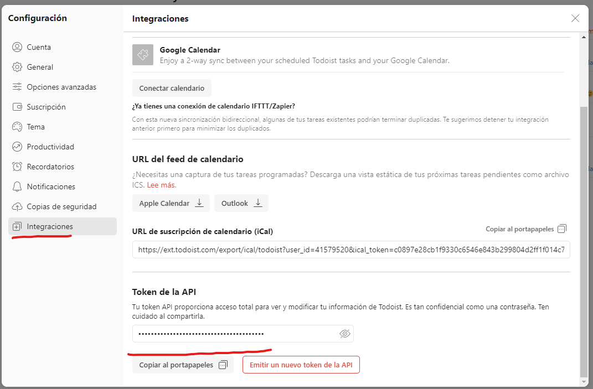
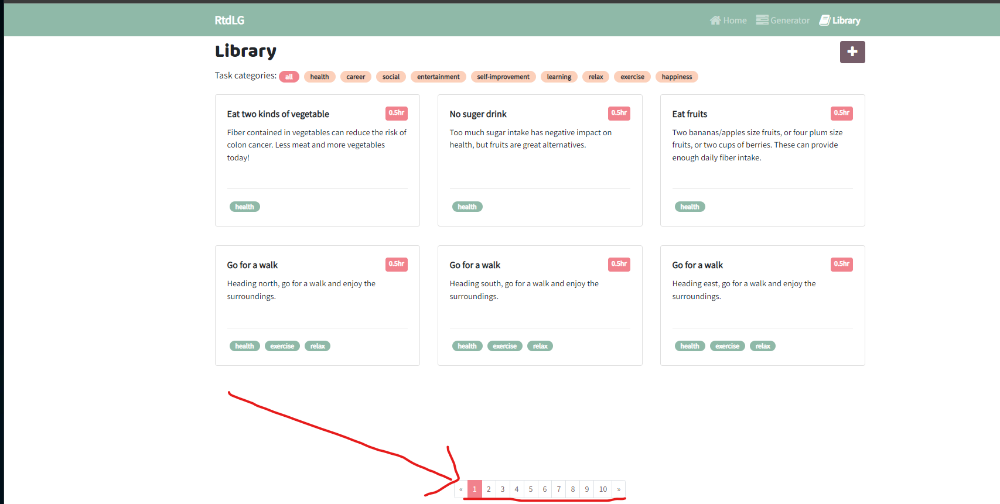
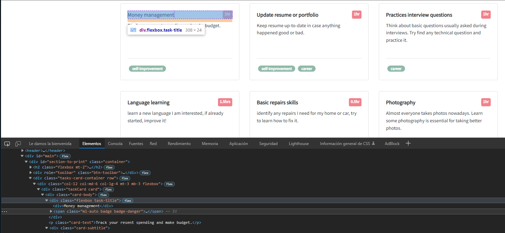
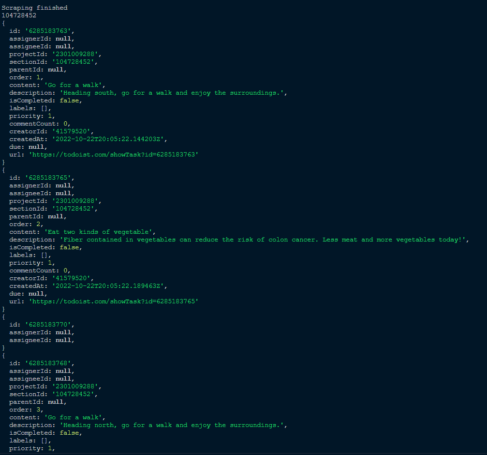
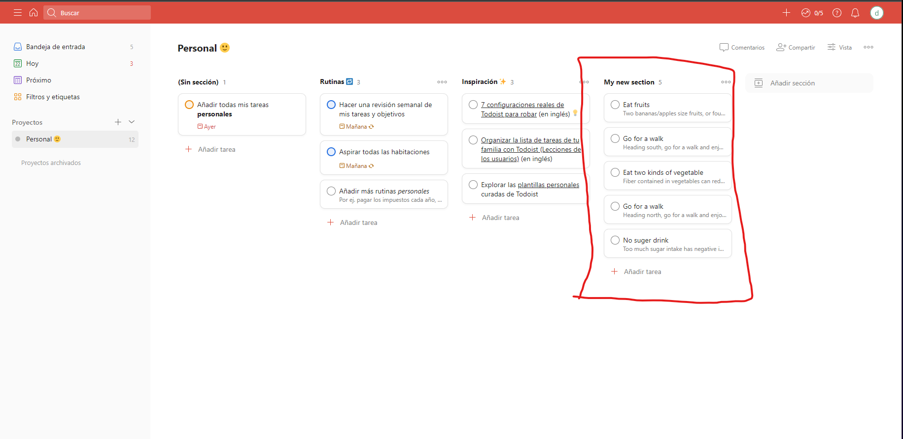

# Test-IncFile
 ## Webscraping with puppet to make random task's in todoist.com
 ---
 ### Resources
 * NodeJS
    * Puppeteer
    * Todoist_API
    * Dotenv (For enviroment variables)
---

### Node JS
Node.js is an open-source, cross-platform, back-end JavaScript runtime environment that runs on a JavaScript Engine (i.e. V8 engine) and executes JavaScript code outside a web browser, which was designed to build scalable network applications. Node.js lets developers use JavaScript to write command line tools and for server-side scripting—running scripts server-side to produce dynamic web page content before the page is sent to the user's web browser. Consequently, Node.js represents a "JavaScript everywhere" paradigm, unifying web-application development around a single programming language, rather than different languages for server-side and client-side scripts.

- [Learn more aboute NodeJS](https://nodejs.org/en/)

### Puppeteer
Puppeteer is a Node.js library which provides a high-level API to control Chrome/Chromium over the DevTools Protocol. Puppeteer runs in headless mode by default, but can be configured to run in full (non-headless) Chrome/Chromium.

What can I do?
Most things that you can do manually in the browser can be done using Puppeteer! Here are a few examples to get you started:

* Generate screenshots and PDFs of pages.
* Crawl a SPA (Single-Page Application) and generate pre-rendered content (i.e. "SSR" (Server-Side Rendering)).
* Automate form submission, UI testing, keyboard input, etc.
* Create an automated testing environment using the latest JavaScript and browser features.
* Capture a timeline trace of your site to help diagnose performance issues.
Test Chrome Extensions.

[Learn more about puppeteer](https://pptr.dev/)

---

### Todoist API
Todoist is an app that allows you to plan out your day and week. You can use the tool to add simple tasks that you tick off as you go, and add descriptions for each of these. The app launched in 2007, and the company is based in California.

You can have access to your acount within an API that they provides.

For more info about and guides, check the [Todoist API documentation](https://developer.todoist.com/guides/#developing-with-todoist)

---

## The start of the proyect
Firstable, we gonna create the proyect.
~~~
npm init -y
~~~
Then install al the dependencies that we gonna need.
~~~
npm install puppeteer
~~~

~~~
npm install @doist/todoist-api-typescript
~~~
After that we gonna create a new *index.js* and import the dependencies.
~~~javascript
import { TodoistApi } from "@doist/todoist-api-typescript";
import puppeteer from "puppeteer";
import * as dotenv from "dotenv";
dotenv.config();
~~~
So, seeking on the api documentation we know that we gonna use a *TOKEN* that they give us in the account configuration.

So, then this is the object that we gonna create.
~~~javascript
const api = new TodoistApi(process.env.TOKEN_API); //Put your own Token
~~~
Let's start with an async function autocallable and instantiate the constructors of the methods that we gonna use.
~~~javascript
(async () => {
    const browser = await puppeteer.launch();//Puppeteer init
    const page = await browser.newPage();//method of puppeteer for the browser
~~~
Then we goona call *page* and open the website and wait until this is loaded
~~~javascript
await page.goto("https://randomtodolistgenerator.herokuapp.com/library");//Go to the website
    await page.waitForSelector(".taskCard");//wait for the selector is loaded
~~~
Once the website is loaded, we gonna check all the <'li'> labels and click on one selected randomdly this for more dinamyc data in the to do list.
~~~javascript
    await page.evaluate(() => {
    const elements = [...document.querySelectorAll("li")];
    const targetElement = elements.find(
        (e) => e.innerText == `${Math.floor(Math.random() * 10) + 1}`
    );
    if (targetElement) targetElement.click();
    });
~~~

After that we gonna scrap the data of all the task cards, name and text, each card will be saved in an array.
~~~javascript
    const scrapedTasks = await page.evaluate(() => {
    const elements = document.querySelectorAll(".card-body");//Get all the cards

    const tasks = [];
    for (let element of elements) {
        const task = {
            name: element.querySelector(".flexbox div").innerText,//get the title text
            text: element.querySelector(".card-text").innerText,//get the task text
        };
        task.name = task.name.slice(0, task.name.indexOf("\n"));//delete where incongruency
        tasks.push(task);//add task into the array
        }
        return tasks;
    });
~~~

Finally, we will call the todoist API and create a new section where each of the tasks will be saved.

For this we need an id project, then when the section was created, save its id and we gonna put into section id field, check only five elements of the array and add to the new section, they return the id section and all the tasks that were saved.

We send to the console that the scraping is finished and close the browser.

This is the finish of the code.
~~~javascript
    api.addSection({ name: "My new section ", projectId:"2301009288" })
    .then((section) =>{
            const sectId =  section.id
            for (let i = 0; i < 5; i++) {
                api
                    .addTask({
                        isCompleted: false,
                        content: scrapedTasks[i].name,
                        description: scrapedTasks[i].text,
                        projectId: "2301009288",
                        sectionId: sectId,
                    })
                    .then((task) => console.log(task))
                    .catch((error) => console.log(error));
            }
            console.log(section.id)
    })
    .catch((error) => console.log(error))

    await browser.close(console.log("Scraping finished"));
})();
~~~

Let's check the todoist account.

And that's it, it works perfectly!

### Thanks everyone for read! and good luck 🚀💻🌌